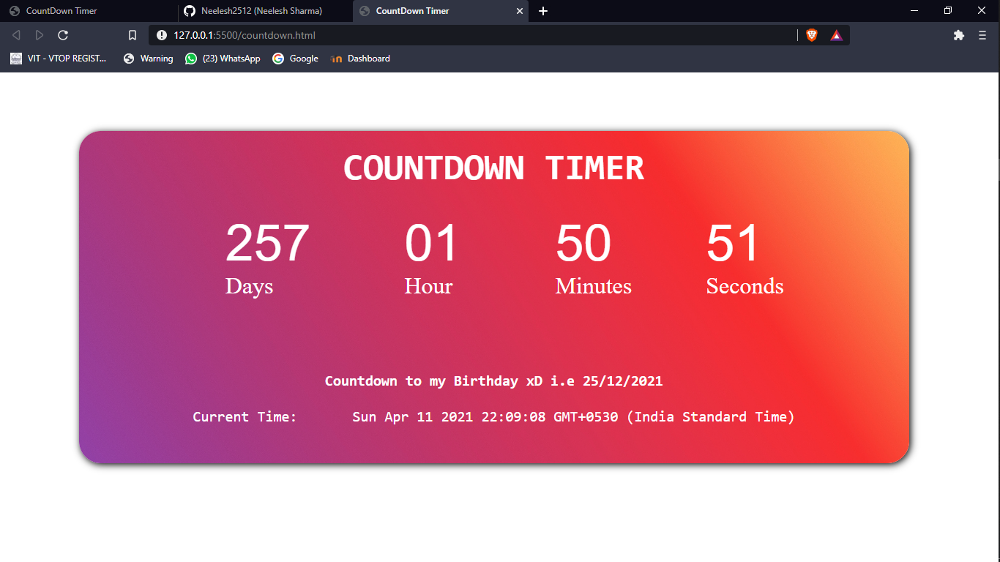
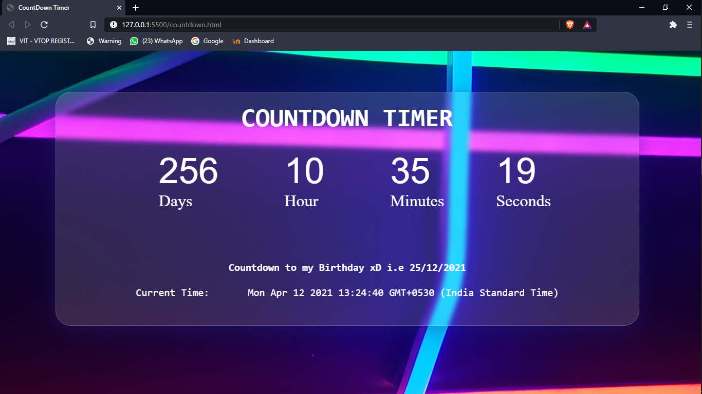

# countdown-with-javascript
This is a countdown and will stop on my Birthday xD You can change tha targetted in script file. 

Another design with glass morphism

code for glassmorphism: Copy this and replace it with background image in container's css
background: rgba( 246, 246, 246, 0.15 );
box-shadow: 0 8px 32px 0 rgba( 31, 38, 135, 0.37 );
backdrop-filter: blur( 4.5px );
-webkit-backdrop-filter: blur( 4.5px );
border-radius: 10px;
border: 1px solid rgba( 255, 255, 255, 0.18 );
